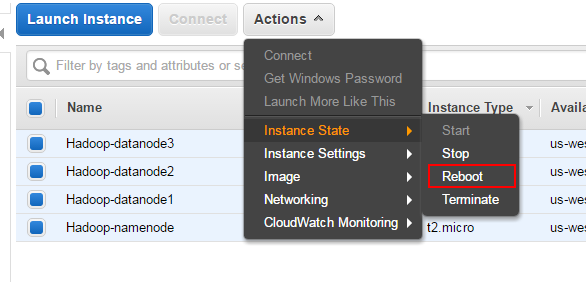

# How to Setup an Apache Hadoop Cluster on AWS EC2

## Contents
1. Introduction

2. Pre-Requisites

3. AWS EC2 Startup
*    Select Instance
*    Instance Type
*    Instance Details
*    Storage
*    Instance Tags
*    Security Group
*    Launch Instances
*    Naming the Instances

4. Setting Up Instances
*    Copy Instance Public DNS Name

5. Common Setup on All Nodes
*    All Nodes: Install Java
*    All Nodes: Install Apache Hadoop
*    All Nodes: Setup JAVA_HOME
*    All Nodes: Update core_site.xml
*    All Nodes: Create Data Dir

6. Configuring NameNode
*    Namenode: Password Less SSH
*    Datanode: Setup Public Key
*    Namenode: Setup SSH Config
*    Namenode: Setup HDFS Properties
*    Namenode: Setup MapReduce Properties
*    Namenode: Setup YARN Properties
*    Namenode: Setup Master and Slaves

7. Configuring Data Nodes

8. Starting the Hadoop Cluster
*    Check the Web UI

9. Summary

# 1. Introduction
Lets talk about how to setup an Apache Hadoop cluster on AWS.

In a previous article, we discussed setting up a Hadoop processing pipeline on a single node (laptop). That involved running all the components of Hadoop on a single machine. In the setup we discuss here, we setup a multi-node cluster to run processing jobs.

Our setup involves a single NameNode and three DataNodes which serve as processing slaves.

Starting with setting up the AWS EC2 resources, we take you all the way through complete configuration of the machines in this arrangement.

We use Apache Hadoop 2.7.3 for this demonstration.

# 2. Pre-Requisites
Sign up for an AWS account if you don’t already have one. You get some resources free for the first year, including an EC2 Micro Instance.

# 3. AWS EC2 Startup
We will now create 4 instances of Ubuntu Server 16.04 LTS using Amazon EC2.

# 4. Select Instance
Go to your AWS Console, Click on Launch Instance and select Ubuntu Server 16.04 LTS.

# 5. Instance Type
For the instance type, we choose t2.micro since that is sufficient for the purposes of the demo. If you have a need for a high-memory or high-cpu instance, you can select one of those.

Click Next to Configure Instance Details

# 6. Instance Details
Here, we request 4 instances of the selected machine type. We also choose a subnet (us-west-1b) just so we can launch into the same location if we need more machines.

Click Next to Add Storage

# 7. Storage
For our purpose, the default instance storage of 8GB is sufficient. If you need more storage, either increase the size or attach a disk by clicking “Add Volume”. If you add a volume, you will need to attach the volume to your instance, format it and mount it. Since this is a beginner tutorial, these steps are not covered here.

Click Next to Add Tags to your instances.

# 8. Instance Tags
A tag allows you to identify your instance with a name you can choose.

Click Add Tag, set the Key to “Name” and value to “Hadoop”. We will use this tag to re-label our instances as “namenode”, “datanode1” and so on later on. For now leave the value of all the instances as “Hadoop”.

Click Next to configure Security Group for the instances.

# 9. Security Group
For the security group, we create a completely open security group for the purposes of testing.

Finally we get to the Launch screen.

# Launch Instances
Review the information again and click Launch to start the instances. You will need to create a key pair or use an existing key pair. Follow the instructions on the Launch Wizard to create a new key pair. Then click “I acknowledge ..” and then Launch Instances.

You can now go to the instances page and check on the status of the instances.

# Naming the instances
On the instances page, let us setup the names of the instances. These are not DNS names, but names we assign to help us distinguish between them.

Click the pencil icon next to the name and setup the names as shown.

# Setting Up Instances
Once the instances are up and running, it is time to set them up for our purpose. This includes the following:

* Setup password-less login between the namenode and the datanodes.
* Install java.
* Setup Hadoop.

# Copy Instance Public DNS Name
We now need to copy the Public DNS Name of each node (1 namenode and 3 datanodes). These names are used in the configuration steps below. Since the DNS is specific to each setup, we refer to the names as follows.

For example, in the description below, if you see <nnode>, substitute with the value of <NameNode Public DNS>. Similarly for <dnode1> and so on.

|   nnode   |	<NameNode Public DNS>   |
|   dnode1  |	<DataNode1 Public DNS>  |
|   dnode2  |	<DataNode2 Public DNS>  |
|   dnode3  |	<DataNode3 Public DNS>  |

# Common Setup on All Nodes
Some setup is common to all the nodes: NameNode and DataNodes. This is covered in this section.

# All Nodes: Update the instance
Let us update the OS with latest available software patches.

`sudo apt-get update && sudo apt-get -y dist-upgrade`

After the updates, the system might require a restart. Perform a Reboot from the EC2 Instances page.

# All Nodes: Install Java
Let us now install Java. We install the package: openjdk-8-jdk-headless on all the nodes.

`sudo apt-get -y install openjdk-8-jdk-headless`

# All Nodes: Install Apache Hadoop
Install Apache Hadoop 2.7.3 on all the instances. Obtain the link to download from the [[Apache website]](https://www.apache.org/dyn/closer.cgi/hadoop/common/hadoop-2.7.3/hadoop-2.7.3.tar.gz) and run the following commands. We install Hadoop under a directory `server` in the home directory.

`
mkdir server
cd server
wget <Link to Hadoop 2.7.3>
tar xvzf hadoop-2.7.3.tar.gz
`

# All Nodes: Setup JAVA_HOME
On each of the nodes, edit `~/server/hadoop-2.7.3/etc/hadoop/hadoop-env.sh`.

Replace this line:
`export JAVA_HOME=${JAVA_HOME}`

With the following line:
`export JAVA_HOME=/usr/lib/jvm/java-8-openjdk-amd64`

# All Nodes: Update `core_site.xml`
On each node, edit `~/server/hadoop-2.7.3/etc/hadoop/core-site.xml` and replace the following lines:
`
<configuration>
</configuration>
`

with these (as mentioned above, replace <nnode> with NameNode’s public DNS):

`
<configuration>
  <property>
    <name>fs.defaultFS</name>
    <value><nnode>:9000</value>
  </property>
</configuration>
`

# All Nodes: Create Data Dir
HDFS needs the data directory to be present on each node: 1 name node and 3 data nodes. Create this directory as shown and change ownership to user ubuntu.

`sudo mkdir -p /usr/local/hadoop/hdfs/data`
`sudo chown -R ubuntu:ubuntu /usr/local/hadoop/hdfs/data`

# Configuring NameNode
After performing configuration common to all nodes, let us now setup the NameNode.

# Namenode: Password Less SSH
As mentioned before, we need password-less SSH between the name nodes and the data nodes. Let us create a public-private key pair for this purpose on the namenode.
`namenode> ssh-keygen`

Use the default (`/home/ubuntu/.ssh/id_rsa`) for the key location and hit enter for an empty passphrase.

# Datanodes: Setup Public Key
The public key is saved in `/home/ubuntu/.ssh/id_rsa.pub.` We need to copy this file from the namenode to each data node and append the contents to `/home/ubuntu/.ssh/authorized_keys` on each data node.

`datanode1> cat id_rsa.pub >> ~/.ssh/authorized_keys`
`datanode2> cat id_rsa.pub >> ~/.ssh/authorized_keys`
`datanode3> cat id_rsa.pub >> ~/.ssh/authorized_keys`

# Namenode: Setup SSH Config
SSH uses a configuration file located at `~/.ssh/config` for various parameters. Set it up as shown below. Again, substitute each node’s Public DNS for the HostName parameter (for example, replace <nnode> with EC2 Public DNS for NameNode).

`
Host nnode
  HostName <nnode>
  User ubuntu
  IdentityFile ~/.ssh/id_rsa

Host dnode1
  HostName <dnode1>
  User ubuntu
  IdentityFile ~/.ssh/id_rsa

Host dnode2
  HostName <dnode2>
  User ubuntu
  IdentityFile ~/.ssh/id_rsa

Host dnode3
  HostName <dnode3>
  User ubuntu
  IdentityFile ~/.ssh/id_rsa
`

At this point, verify that password-less operation works on each node as follows (the first time, you will get a warning that the host is unknown and whether you want to connect to it. Type yes and hit enter. This step is needed once only):

`
namenode> ssh nnode
namenode> ssh dnode1
namenode> ssh dnode2
namenode> ssh dnode3
`

# Namenode: Setup HDFS Properties
On the NameNode, edit the following file:`~/server/hadoop-2.7.3/etc/hadoop/hdfs-site.xml`

Replace:
`
<configuration>
</configuration>
`

With:
`
<configuration>
  <property>
    <name>dfs.replication</name>
    <value>3</value>
  </property>
  <property>
    <name>dfs.namenode.name.dir</name>
    <value>file:///usr/local/hadoop/hdfs/data</value>
  </property>
</configuration>
`

# Namenode: Setup MapReduce Properties

On the NameNode, copy the file (`~/server/hadoop-2.7.3/etc/hadoop/mapred-site.xml.template`) to (`~/server/hadoop-2.7.3/etc/hadoop/mapred-site.xml`). Replace:

`
<configuration>
</configuration>
`

With this (as above replace <nnode> with NameNode’s public DNS):

`
<configuration>
  <property>
    <name>mapreduce.jobtracker.address</name>
    <value><nnode>:54311</value>
  </property>
  <property>
    <name>mapreduce.framework.name</name>
    <value>yarn</value>
  </property>
</configuration>
`

# Namenode: Setup YARN Properties

Next we need to set up `~/server/hadoop-2.7.3/etc/hadoop/yarn-site.xml` on the NameNode. Replace the following:
`
<configuration>

<!-- Site specific YARN configuration properties -->

</configuration>
`

With (as before, replace <nnode> with NameNode’s public DNS):
`
<configuration>

  <!-- Site specific YARN configuration properties -->
  <property>
    <name>yarn.nodemanager.aux-services</name>
    <value>mapreduce_shuffle</value>
  </property>
  <property>
    <name>yarn.nodemanager.aux-services.mapreduce.shuffle.class</name>
    <value>org.apache.hadoop.mapred.ShuffleHandler</value>
  </property>
  <property>
    <name>yarn.resourcemanager.hostname</name>
    <value><nnode></value>
  </property>

</configuration>
`

# Namenode: Setup Master and Slaves

On the NameNode, create `~/server/hadoop-2.7.3/etc/hadoop/masters` with the following (replace <nnode> with the NameNode’s public DNS):
`<nnode>`

Also replace all content in `~/server/hadoop-2.7.3/etc/hadoop/slaves` with (replace each of `<dnode1>`, etc with the appropriate DateNode’s public DNS):
`
<dnode1>
<dnode2>
<dnode3>
`

# Configuring Data Nodes
After covering configuration common to both NameNode and DataNodes, we have a little bit of configuring specific to DataNodes. On each data node, edit the file `~/server/hadoop-2.7.3/etc/hadoop/hdfs-site.xml` and replace the following:

`
<configuration>
</configuration>
`

With:
`
<property>
    <name>dfs.replication</name>
    <value>3</value>
  </property>
  <property>
    <name>dfs.datanode.data.dir</name>
    <value>file:///usr/local/hadoop/hdfs/data</value>
  </property>
`

# Starting the Hadoop Cluster
After all that configuration, it is now time to test drive the cluster. First, format the HDFS file system on the NameNode:
`
namenode> cd ~/server
namenode> ./hadoop-2.7.3/bin/hdfs namenode -format
`

Finally, startup the Hadoop Cluster. After this step you should have all the daemons running on the NameNode and the DataNodes.

`
namenode> ./hadoop-2.7.3/sbin/start-dfs.sh
namenode> ./hadoop-2.7.3/sbin/start-yarn.sh
namenode> ./hadoop-2.7.3/sbin/mr-jobhistory-daemon.sh start historyserver
`

Check the console carefully for any error messages. If everything looks OK, check for the daemons using `jps`.

`namenode> jps`

You can also check on the datanodes for java processes.

`datanode1> jps`

# Check the Web UI
Once the cluster is running, we can check the web UI for the status of the data nodes. Go to <nnode>:50070 for the Web UI and verify that the 3 data nodes added are online.

# 9. Summary
This article showed you how to setup Apache Hadoop on an Amazon EC2 cluster. Starting  with standard Ubuntu 16.04 LTS instances, we configured the machines with Java and Apache Hadoop. Next we covered setting up various Hadoop components according to the role on each node. In the next article in this series on Apache Hadoop, we look into running jobs on the cluster.